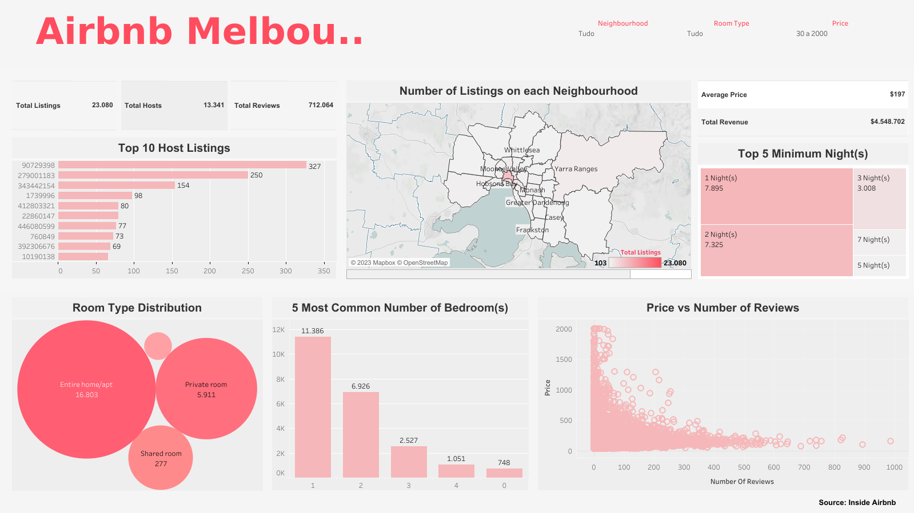

# Data Analysis | Airbnb Melbourne Australia

 

## Project Description

 

In this project, I intend to conduct an analysis of Melbourne Airbnb Data. This dataset contains information about hosts, neighbourhoods, room types, prices, reviews, ratings, etc. Through the [Inside Airbnb](http://insideairbnb.com/) website, it is possible to collect this dataset and you can even find Airbnb data for other cities around the world.

This analysis aims to explore the data, perform necessary data cleaning steps to prepare it for analysis, and then delve into the data to reveal trends and patterns. The goal is to provide valuable insights into how Airbnb is utilized in Melbourne and understand its implications for hosts, guests, and the wider community.

 

## Context

 

Airbnb, a global online marketplace headquartered in San Francisco, California, was founded in 2008 and operates in over 191 countries. It enables individuals to monetize their spaces by renting them out to travelers. 

Through Airbnb’s platform, hosts can offer guests short-term lodging and tourism-related activities. Guests have the flexibility to search for accommodations based on type, dates, location, and price, and can even seek out specific types of homes, such as bed and breakfasts, unique homes, and vacation homes.

Known for its diverse accommodations, Airbnb boasts a variety of properties ranging from single rooms and apartments to moored yachts, houseboats, entire islands, and even castles.

By offering unique and personalized experiences, Airbnb has transformed the travel industry. A prime example of this success is Melbourne, Australia. 

This city, celebrated for its cultural diversity, blend of modern and historical architecture, lively arts scene, and passion for good food and coffee, perfectly embodies Airbnb’s ethos of local experiences and personal connections. The wide variety of unique accommodations available in Melbourne further enhances its appeal to travelers.

 

## Questions

 

I have defined the problem statement as the following: Analyze the key characteristics of Airbnb listings in Melbourne to gain a comprehensive understanding of the local rental market.

In alignement with the problem statement, the following research questions have been formulated: 

1. Who are the top 10 hosts with the most listings?

2. Where are the top 10 Melbourne Airbnbs listings located? 

3. How are the room type distributed in the listings?

4. What are the 5 most common numbers of bedrooms in the listings?

5. What are the 5 most frequent minimum nights?

6. What are the four amenities most commonly provided?

7. Which room type in Melbourne's Airbnb listings has the highest number of reviews?

8. What is the average of amenities by room type?

9. Is the average price per night higher for private room than for shared rooms?

10. Properties with more reviews might be priced higher due to their popularity?

11. Listings with more amenities might be priced higher?

 

## Dataset

 

The data was gathered from the Inside Airbnb website, a platform that provides access to Airbnb data for cities around the world. The dataset was compiled on 04 September 2023.

The dataset is available through this [link](http://insideairbnb.com/get-the-data/)

 

## Tools used

 

In this project, I utilized the Python programming language via the Jupyter Notebook as an extension in VSCode, and employed Tableau for dashboard development.

 

## Dashboard

The dashboard is in the following [link](https://public.tableau.com/app/profile/tauan.oliveira/viz/DataAnalysis-AirbnbMelbourne/MelbourneListings)

 

## Slide Presentation

 

You can find the slide presentation in this repository, or if you prefer, in the following [link]()

 

## Author

 

    👤 Tauan Oliveira

    * Kaggle: https://www.kaggle.com/tauanoliveira

    * Tableau: https://public.tableau.com/app/profile/tauan.oliveira/vizzes

    * Github: https://github.com/TndOliveira